# funJplot

**funJplot** is a lightweight and simple Python library, specifically designed for creating animations in Jupyter notebooks using NumPy arrays. The main goal is to provide an intuitive tool for learning and visualizing concepts related to mathematical algebra, statistics, and related disciplines.

**Warning: Pre-Alpha Stage**

This library is currently in the pre-alpha phase. This means that the API may undergo significant changes without notice, and there might be bugs or incomplete features. Use in production environments is discouraged. However, we are excited to share our ongoing work and welcome feedback and contributions from the community.

## Full-Readme.md
[Access to full documentation](src/README.md)

## Data
For having a test dataset, as example is tooked from sklearn that load dataset indipendetly from the csv

## Class Diag

```mermaid
classDiagram
    %% Abstract Base Class
    class GeometricAnimation {
        <<abstract>>
        #frame_count: int
        #frame_duration_ms: int
        #plot_scale: float
        
        +__init__(frame_count=100, frame_duration_ms=50, plot_scale=1.09)*
        #_create_figure()* Figure
        +show() None
    }
    
    %% GUI Manager
    class GuiInterface {
        -parent_animation: GeometricAnimation
        -play_button: dict
        -pause_button: dict
        -slider_steps: list
        -animation_slider: dict
        
        +__init__(parent_animation)
    }
    
    %% Parametric Curve Base
    class ParametricCurve {
        <<abstract>>
        #rotations: float
        #x_coordinates: np.array
        #y_coordinates: np.array
        #gui: GuiInterface
        
        +__init__(frame_count=100, frame_duration_ms=50, plot_scale=1.09, rotations=4)
        +compute_points(t_parameter)* (np.array, np.array)
        #_create_figure() Figure
    }
    
    %% Vector Rotation
    class VectorRotation {
        #rotation_angles: np.array
        #cosine_values: np.array
        #sine_values: np.array
        
        +__init__(frame_count=100, frame_duration_ms=50, plot_scale=1.2)
        #_create_figure() Figure
    }
    
    %% Concrete Implementations
    class Spiral {
        -a_param: float
        -b_param: float
        
        +__init__(frame_count=200, frame_duration_ms=30, plot_scale=5, rotations=4, a=0.5, b=0.2)
        +compute_points(t_parameter) (np.array, np.array)
    }
    
    class Ellipse {
        -semi_major_axis: float
        -semi_minor_axis: float
        
        +__init__(frame_count=200, frame_duration_ms=30, plot_scale=3, rotations=1, a=2, b=1)
        +compute_points(t_parameter) (np.array, np.array)
    }
    
    class Lissajous {
        -amplitude_a: float
        -amplitude_b: float
        -phase_delta: float
        -frequency_n: float
        -frequency_m: float
        
        +__init__(frame_count=300, frame_duration_ms=20, plot_scale=1.5, rotations=4, a=1, b=1, phase_delta=π/2, freq_n=3, freq_m=2)
        +compute_points(t_parameter) (np.array, np.array)
    }
    
    class LorenzAttractor {
        -sigma: float
        -rho: float
        -beta: float
        -time_step: float
        -initial_x: float
        -initial_y: float
        -initial_z: float
        
        +__init__(frame_count=1500, frame_duration_ms=10, plot_scale=30, sigma=10.0, rho=28.0, beta=8.0/3.0, dt=0.01, initial_pos=(1.0,1.0,1.0))
        +compute_points(t_parameter) (np.array, np.array)
    }
    
    %% Inheritance Relationships
    GeometricAnimation <|-- ParametricCurve
    GeometricAnimation <|-- VectorRotation
    ParametricCurve <|-- Spiral
    ParametricCurve <|-- Ellipse
    ParametricCurve <|-- Lissajous
    ParametricCurve <|-- LorenzAttractor
    
    %% Composition Relationships
    GeometricAnimation "1" *-- "1" GuiInterface : contains
    ParametricCurve "1" *-- "1" GuiInterface : contains
    VectorRotation "1" *-- "1" GuiInterface : contains
```

